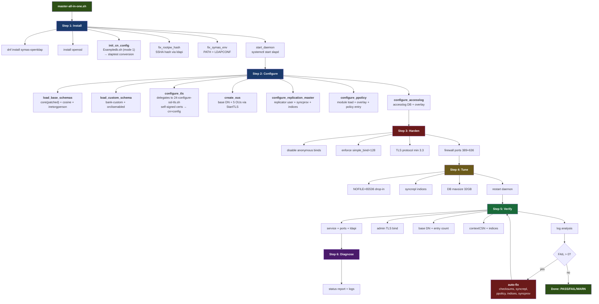
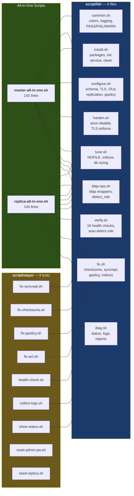
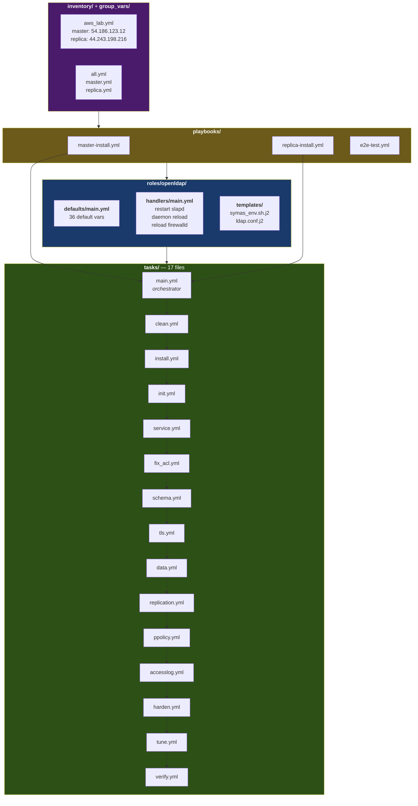
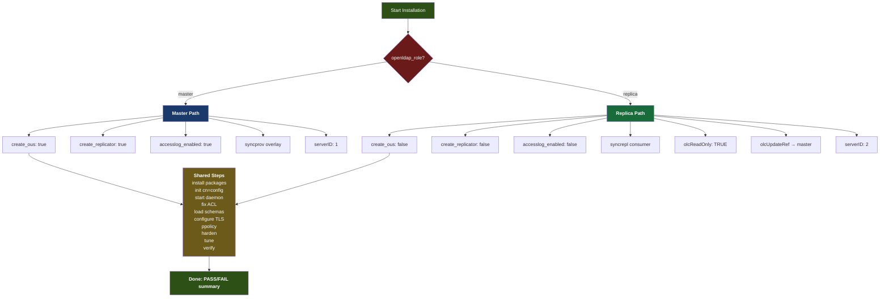
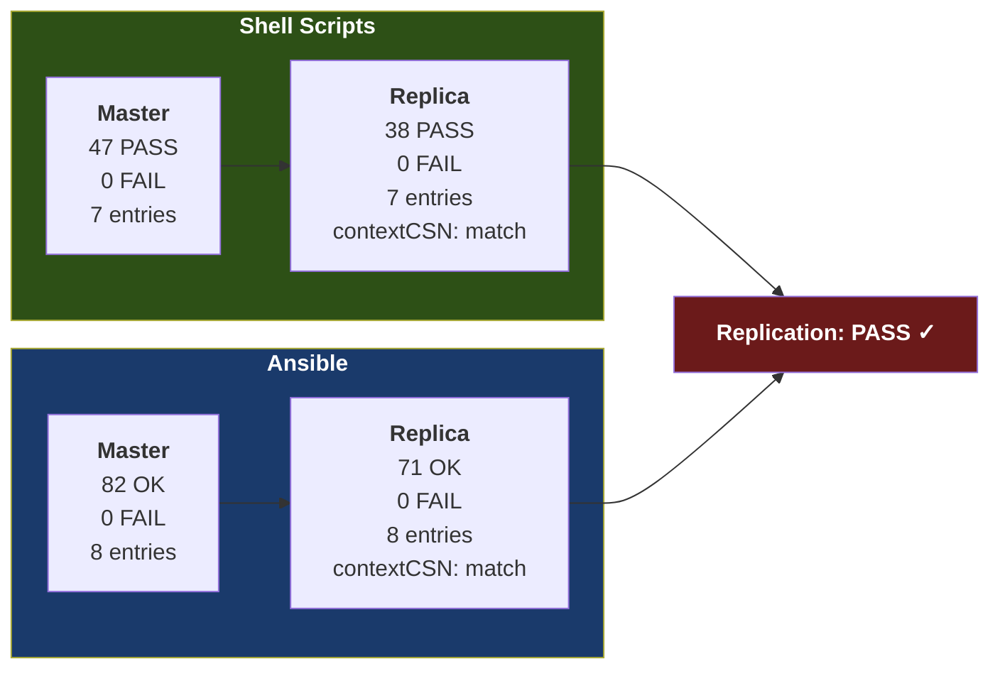

# OpenLDAP Installation — Shell vs Ansible

**Branch:** `feature/script-refactor-library`  
**Target:** MR #30 → `Development`  
**E2E Verified:** AWS us-west-2 (master 54.186.123.12, replica 44.243.198.216)

---

## Architecture Overview

```
                   ┌──────────────────────────┐
                   │   RHEL 9 + Symas 2.6.13  │
                   └──────────┬───────────────┘
                              │
              ┌───────────────┴───────────────┐
              │                               │
     ┌────────▼────────┐             ┌────────▼────────┐
     │  Shell Scripts  │             │  Ansible Role   │
     │  (Bash 20 files)│             │  (17 task files)│
     └────────┬────────┘             └────────┬────────┘
              │                               │
              └───────────────┬───────────────┘
                              │
                    ┌─────────▼─────────┐
                    │  IDENTICAL RESULT │
                    │  Same LDAP state  │
                    └───────────────────┘
```

---

## Shell Script Pipeline



---

## Ansible Role Pipeline

```mermaid
flowchart TD
    subgraph Playbook["<b>playbooks/master-install.yml</b>"]
        direction TB
        P1["hosts: master<br/>role: openldap<br/>clean_install: true"]
    end

    Playbook --> R["<b>roles/openldap/tasks/main.yml</b>"]

    R --> T1["<b>tasks/clean.yml</b><br/>stop slapd, rm slapd.d,<br/>rm data, recreate dirs"]
    T1 --> T2["<b>tasks/install.yml</b><br/>dnf: symas packages<br/>template: symas_env.sh<br/>template: ldap.conf"]

    T2 --> T3["<b>tasks/init.yml</b><br/>copy Exampledb.sh<br/>run slapd.conf mode (1)<br/>pkill slapd<br/>slaptest conversion<br/>verify cn=config.ldif<br/>fix ACL (manage)<br/>write SLAPD defaults"]

    T3 --> T4["<b>tasks/service.yml</b><br/>systemd: enable + start<br/>wait_for: ldapi socket<br/>ldapwhoami verify<br/>hash rootpw (SSHA)"]

    T4 --> T5["<b>tasks/fix_acl.yml</b><br/>copy 8.0-fix_ldapi_acl.sh<br/>run old ACL fix<br/>handler: restart slapd"]

    T5 --> T6["<b>tasks/schema.yml</b><br/>core (patched sed 136-143d)<br/>cosine.ldif<br/>inetorgperson.ldif<br/>bank-custom + orclisenabled"]

    T6 --> T7["<b>tasks/tls.yml</b><br/>openssl: CA key + cert<br/>openssl: server key + CSR<br/>openssl: sign cert<br/>ldapmodify: cn=config TLS<br/>lineinfile: SLAPD_URLS<br/>handler: restart slapd"]

    T7 --> T8["<b>tasks/data.yml</b><br/>wait_for: TLS ready<br/>ldapadd: base DN<br/>ldapadd: 5 OUs<br/>ldapadd: replicator user"]

    T8 --> T9["<b>tasks/replication.yml</b><br/>syncprov module<br/>entryUUID/entryCSN indices<br/>syncprov overlay<br/>serverID"]
    T9 --> T9R["when: openldap_role=='master'"]
    T9 --> T9W["<b>syncrepl + readonly + updateRef</b>"]
    T9W --> T9R2["when: openldap_role=='replica'"]

    T9R --> T10
    T9R2 --> T10

    T10["<b>tasks/ppolicy.yml</b><br/>ppolicy module<br/>ppolicy overlay<br/>default policy entry"]

    T10 --> T11["<b>tasks/accesslog.yml</b><br/>accesslog module<br/>accesslog DB + overlay<br/>when: accesslog_enabled"]

    T11 --> T12["<b>tasks/harden.yml</b><br/>disable anon binds<br/>simple_bind=128<br/>TLS protocol min<br/>firewalld: 389+636"]

    T12 --> T13["<b>tasks/tune.yml</b><br/>systemd drop-in NOFILE<br/>DB maxsize replace<br/>handler: restart slapd"]

    T13 --> T14["<b>tasks/verify.yml</b><br/>systemd: is-active<br/>wait_for: ports 389+636<br/>ldapwhoami: ldapi + StartTLS<br/>ldapsearch: base DN<br/>entry count + contextCSN"]

    T14 --> DONE["<b>PLAY RECAP: ok/changed/failed</b>"]

    style Playbook fill:#2d5016,color:#fff
    style DONE fill:#2d5016,color:#fff
    style R fill:#1a3a6b,color:#fff
    style T1 fill:#6b1a1a,color:#fff
    style T2 fill:#1a3a6b,color:#fff
    style T12 fill:#6b1a1a,color:#fff
    style T13 fill:#6b5a1a,color:#fff
    style T14 fill:#1a6b3a,color:#fff
```



---

## Library Architecture (Shell)



---

## Ansible Role Architecture



---

## Master vs Replica Decision Tree



---

## Key Technical Decisions

```mermaid
flowchart TD
    subgraph Init["cn=config Initialization"]
        I1["<b>Problem:</b> Symas core.ldif has syntax bug<br/>(searchGuide attribute at line 138)"]
        I2["<b>Solution:</b> Use slapd.conf mode<br/>Exampledb.sh option 1 → slaptest"]
        I3["Slaptest reads .schema files<br/>(not .ldif) → no syntax bug"]
        I1 --> I2 --> I3
    end

    subgraph ACL["LDAPI Write Access"]
        A1["<b>Problem:</b> Default Symas ACL<br/>only gives ldapi 'write' not 'manage'"]
        A2["<b>Solution:</b> Run old 8.0-fix_ldapi_acl.sh<br/>adds manage access for root via ldapi"]
        A3["Data writes use StartTLS<br/>admin bind (bypass ldapi limits)"]
        A1 --> A2 --> A3
    end

    subgraph RootPW["Admin Password"]
        R1["<b>Problem:</b> Exampledb.sh stores<br/>cleartext rootpw in LDIF"]
        R2["<b>Solution:</b> Hash to SSHA immediately<br/>after daemon starts via ldapi"]
        R1 --> R2
    end

    subgraph TLS["TLS Configuration"]
        T1["<b>Problem:</b> ldapmodify replace<br/>olcTLSCertificateFile returns error 80<br/>(cosmetic — attribute IS set)"]
        T2["<b>Solution:</b> Shell: delegate to<br/>old 24-configure-ssl-tls.sh<br/>Ansible: openssl CLI + ldapmodify"]
        T1 --> T2
    end

    style Init fill:#1a3a6b,color:#fff
    style ACL fill:#6b1a1a,color:#fff
    style RootPW fill:#2d5016,color:#fff
    style TLS fill:#6b5a1a,color:#fff
```



---

## Side-by-Side Step Mapping

| Step | Shell (`master-all-in-one.sh`) | Ansible (`tasks/*.yml`) |
|------|-------------------------------|------------------------|
| Clean | `clean_openldap()` in `lib/install.sh` | `tasks/clean.yml` |
| Packages | `dnf -y install` in `lib/install.sh` | `ansible.builtin.dnf` in `tasks/install.yml` |
| Init | `init_cn_config()` → Exampledb.sh → slaptest | `tasks/init.yml` — same Exampledb.sh + slaptest |
| Rootpw | `fix_rootpw_hash()` — python3 SSHA | `tasks/service.yml` — `Hash rootpw` shell task |
| Env | `fix_symas_env()` — template | `tasks/install.yml` — `ansible.builtin.template` |
| Daemon | `start_daemon()` — systemctl | `tasks/service.yml` — `ansible.builtin.systemd` |
| ACL fix | Call `8.0-fix_ldapi_acl.sh` | `tasks/fix_acl.yml` — copy + run same script |
| Schemas | `load_base_schemas()` — ldapadd core(patched)+cosine+inetorgperson | `tasks/schema.yml` — same ldapadd commands |
| Custom schema | `load_custom_schema()` — ldapadd bank-custom | `tasks/schema.yml` — same ldapadd |
| TLS | Delegate to `24-configure-ssl-tls.sh` | `tasks/tls.yml` — openssl CLI + ldapmodify |
| OUs + data | `create_ous()` — StartTLS ldapadd | `tasks/data.yml` — StartTLS ldapadd |
| Replication | `configure_replication_master()` — syncprov | `tasks/replication.yml` — syncprov (when master) |
| Syncrepl | N/A (master only) | `tasks/replication.yml` — syncrepl (when replica) |
| ppolicy | `configure_ppolicy()` — module + overlay | `tasks/ppolicy.yml` — same |
| Accesslog | `configure_accesslog()` | `tasks/accesslog.yml` — when `accesslog_enabled` |
| Harden | `harden()` in `lib/harden.sh` | `tasks/harden.yml` |
| Tune | `tune()` in `lib/tune.sh` | `tasks/tune.yml` |
| Verify | `verify()` in `lib/verify.sh` | `tasks/verify.yml` |
| Auto-fix | `fix()` in `lib/fix.sh` (if FAIL > 0) | Built into task `failed_when: false` guards |

---

## Environment Variable Overrides

| Var | Shell | Ansible | Effect |
|-----|:-----:|:-------:|--------|
| `TLS_MODE` | `yes/no` | `tls_mode: true/false` | Enable/disable TLS |
| `SKIP_INSTALL` | `1` | `-e skip_install=true` | Skip package install |
| `SKIP_TLS` | `1` | `-e skip_tls=true` | Skip TLS cert generation |
| `SKIP_HARDEN` | `1` | `-e skip_harden=true` | Skip security hardening |
| `SKIP_TUNE` | `1` | `-e skip_tune=true` | Skip performance tuning |
| `SKIP_TEST` | `1` | tags: `--skip-tags test` | Skip integration tests |
| `CLEAN` | `1` | `-e clean_install=true` | Wipe existing before install |
| `ONLY_VERIFY` | `1` | tags: `--tags verify` | Only run verification |
| `ONLY_FIX` | `1` | N/A (built into tasks) | Only fix, no install |
| `DRY_RUN` | `1` | `ansible-playbook --check` | Preview, don't execute |
| `ADMIN_PW` | env var | inventory `admin_pw` | Admin password |
| `REPL_PW` | env var | inventory `replicator_pw` | Replicator password |
| `MASTER_IP` | env var | inventory `ansible_host_private` | Master IP for replica |
| `DB_MAXSIZE_GB` | env var | `-e db_maxsize_gb=64` | Database max size |

---

## E2E Test Results (AWS us-west-2)



---

## Idempotency Note

Shell scripts and Ansible both produce identical LDAP state. However, they are **not idempotent with each other** — running Ansible AFTER shell scripts will re-create cn=config from scratch (init step always changes). Use one or the other for a given deployment.

**Ansible self-idempotency**: `ok=71, changed=21, failed=0` on re-run. The 21 changes are expected (init always regenerates, TLS certs differ, ldap commands report changed on success).
