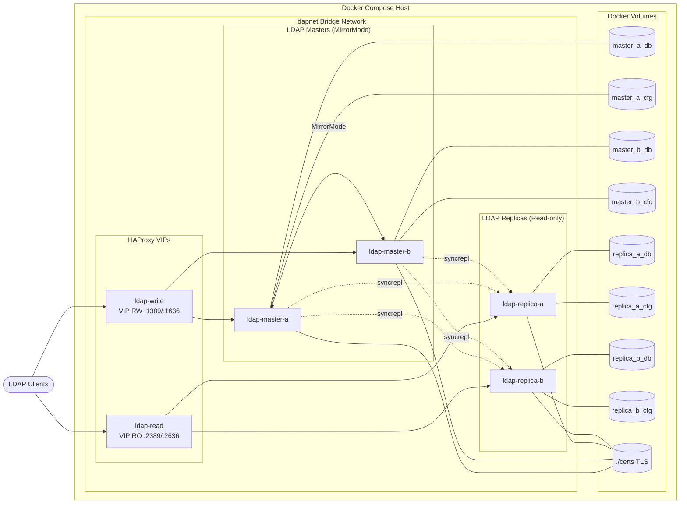
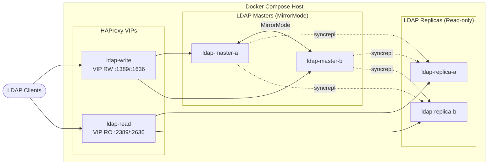
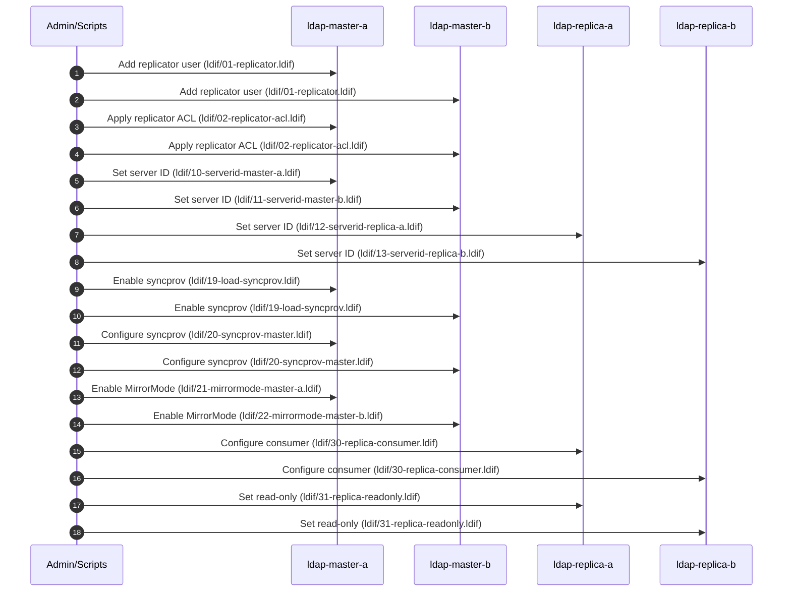

# OpenLDAP MirrorMode Lab - Project Overview

This project provides a local, Docker Compose-based OpenLDAP lab with:

- 2 OpenLDAP masters in MirrorMode (active/active for writes)
- 2 read-only replicas (syncrepl consumers)
- 2 HAProxy VIPs for read/write separation
- TLS-enabled LDAP endpoints
- LDIFs and scripts to configure replication

## Services

- `ldap-master-a` / `ldap-master-b`: OpenLDAP masters in MirrorMode
- `ldap-replica-a` / `ldap-replica-b`: OpenLDAP read-only replicas
- `ldap-write`: HAProxy for read/write traffic (ports 1389/1636)
- `ldap-read`: HAProxy for read-only traffic (ports 2389/2636)

## Network and Ports

All services are attached to the `ldapnet` Docker network.

- Write VIP: `ldap://localhost:1389` (LDAP), `ldaps://localhost:1636` (LDAPS)
- Read VIP: `ldap://localhost:2389` (LDAP), `ldaps://localhost:2636` (LDAPS)

## Replication Summary

- MirrorMode keeps both masters in sync (bi-directional).
- Replicas are configured as read-only consumers using syncrepl from both masters.
- LDIFs under `ldif/` configure the replicator user, ACLs, server IDs, syncprov, MirrorMode, and replica consumers.

## Infrastructure Architecture (Mermaid)



## Architecture Diagram (Mermaid)



## Replication Setup Flow (Mermaid)



## How to Run (Quick)

```bash
./scripts/gen-certs.sh
docker compose up -d
./scripts/apply-replication-ldifs.sh
```

## Notes

- Base DN: `dc=cae,dc=local`
- Admin DN: `cn=admin,dc=cae,dc=local`
- Default passwords: `admin` (admin) and `config` (cn=config)

## Alternative VIP (Keepalived)

For environments that prefer a single floating VIP instead of HAProxy, see
`openldap-mirrormode/keepalived/` for example Keepalived configs and
`scripts/test-keepalived-failover.sh` for a VIP failover test.
