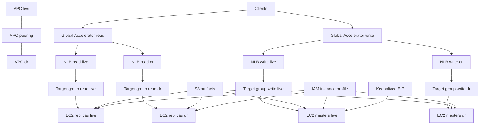

# Terraform OpenLDAP AWS Infra Diagram (Mermaid)

This diagram is derived from the Terraform in `terraform/openldap/*.tf` and shows the main AWS resources and how traffic flows.

If your renderer says "No diagram type detected", it may be reading the whole Markdown file instead of just the Mermaid block. In that case, use the raw Mermaid source file: `terraform/openldap/INFRA_DIAGRAM.mmd`.

Resource mapping (Terraform names):
- VPC live, VPC dr: `aws_vpc.main["live"]`, `aws_vpc.main["dr"]`
- VPC peering: `aws_vpc_peering_connection.peer` plus `aws_route.peer["live"]` and `aws_route.peer["dr"]`
- NLB read and write: `aws_lb.read[...]`, `aws_lb.write[...]`
- Target groups: `aws_lb_target_group.read[...]`, `aws_lb_target_group.write[...]`
- EC2: `aws_instance.node` (masters attach to write target group, replicas attach to read target group)
- Artifacts: `aws_s3_bucket.artifacts` and `aws_s3_object.*` (bootstrap, script, ldif, mirrormode)
- IAM: `aws_iam_instance_profile.ldap` (plus role, optional inline policy, SSM attachment)
- Keepalived EIP: `aws_eip.keepalived` (optional) and `aws_eip_association.keepalived`/`aws_eip_association.keepalived_failover` (optional)

Notes:
- Read vs write paths are distinct NLBs and target groups (`aws_lb.read/*` routes to replicas; `aws_lb.write/*` routes to masters).
- Global Accelerator is only created when `enable_global_accelerator=true` and requires `lb_internal=false` (internet-facing NLBs).
- The keepalived EIP is optional; Terraform intentionally ignores changes to the associated instance to allow failover moves.
