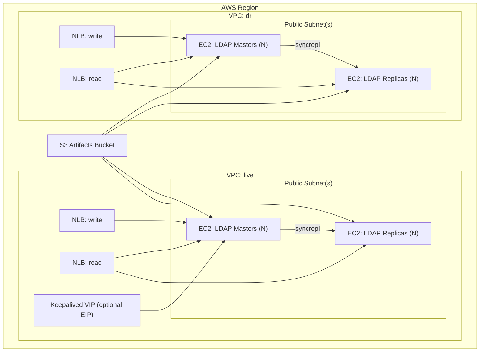

# OpenLDAP DC Simulation Runbook (Terraform + On-Prem)

This runbook explains how the AWS Terraform build boots each instance, and how to
run the same scripts and LDIFs on a real data center host over SSH.

## AWS OpenLDAP Architecture (Mermaid)



## 1) What Terraform does

Terraform provisions:

- 2 VPCs (live, dr), public subnets, and security groups.
- N masters + replicas per VPC (see `masters_per_vpc`, `replicas_per_vpc`).
- Network Load Balancers for read and write.
- Optional keepalived EIP to simulate a single VIP failover.
- (Optional) Global Accelerator endpoints.

After EC2 instances are created and reachable, Terraform runs Ansible (from your controller machine)
to converge the instances:

- Playbook: `ansible/openldap/playbooks/terraform_apply.yml`
- Roles:
  - `openldap_bootstrap` (installs Symas OpenLDAP, creates `cn=config`, sets base DN)
  - `openldap_ldif_public_ips` (applies `terraform/openldap/ldif-public-ips`)
  - `openldap_verify` + `smoke` (post-apply validation)

This means a single `terraform apply` converges both infrastructure and LDAP configuration.

## 1.1) Secure LDAP defaults

The Terraform + Ansible flow now configures secure transport by default:

- Listener mode: `starttls_and_ldaps` (StartTLS on `389`, LDAPS on `636`)
- TLS simple-bind enforcement: enabled (plain simple bind on `389` fails)
- Cert strategy: `external_or_self_signed` by default
  - External PEM values can be provided (`tls_ca_cert_pem`, `tls_cert_pem`, `tls_key_pem`)
  - If external PEMs are not provided, self-signed certs are generated

Related Terraform variables:

- `ldap_tls_mode`
- `require_tls_simple_binds`
- `tls_cert_mode`
- `tls_ca_cert_pem`
- `tls_cert_pem`
- `tls_key_pem`
- `tls_dns_names`
- `tls_ips`

## 2) Notes On Artifacts / Scripts (Deprecated Path)

Older runs used instance `user_data` plus script artifacts in S3. That path is no longer
used by default for installation/configuration. Keep the scripts only as reference.

## 4) AWS Terraform flow (simulation)

1) Configure variables (example `terraform.tfvars`):

```hcl
aws_region = "us-east-1"
project_name = "openldap-mm"
ssh_key_name = "your-keypair"
admin_password = "admin"
replication_password = "replpass"
create_artifacts_bucket = false
upload_local_artifacts = false
```

2) Initialize and apply:

```bash
cd terraform/openldap
terraform init -backend-config=backend.hcl
terraform apply
```

3) Useful outputs (IPs, load balancers):

```bash
terraform output instance_public_ips
terraform output instance_private_ips
terraform output write_lb_dns
terraform output read_lb_dns
```

If you change Ansible roles or LDIF bundles, re-run `terraform apply` to re-converge.

## 4.1) Pause / Resume (Stop Instead Of Destroy)

Pause the lab:

```bash
terraform -chdir=terraform/openldap apply -var='pause_mode=true'
```

Resume the lab:

```bash
terraform -chdir=terraform/openldap apply -var='pause_mode=false'
```

When `pause_mode=true`, Terraform:

- Stops LDAP EC2 instances.
- Disables Global Accelerator by default (`pause_disable_global_accelerator=true`).
- Disables keepalived EIP resources by default (`pause_disable_keepalived=true`).
- Skips Terraform-triggered Ansible runs.

This does not destroy the environment. NLB, EBS, S3/state, and similar resources
can still generate AWS charges while paused.

## 5) Re-Runs / E2E

For the supported one-command apply, destroy, and Go-based E2E flow, see:

- `terraform/openldap/E2E.md`

## 6) SSH / Console Access

For how to connect to every EC2 instance created by this stack, see:

- `terraform/openldap/SSH_ACCESS.md`
