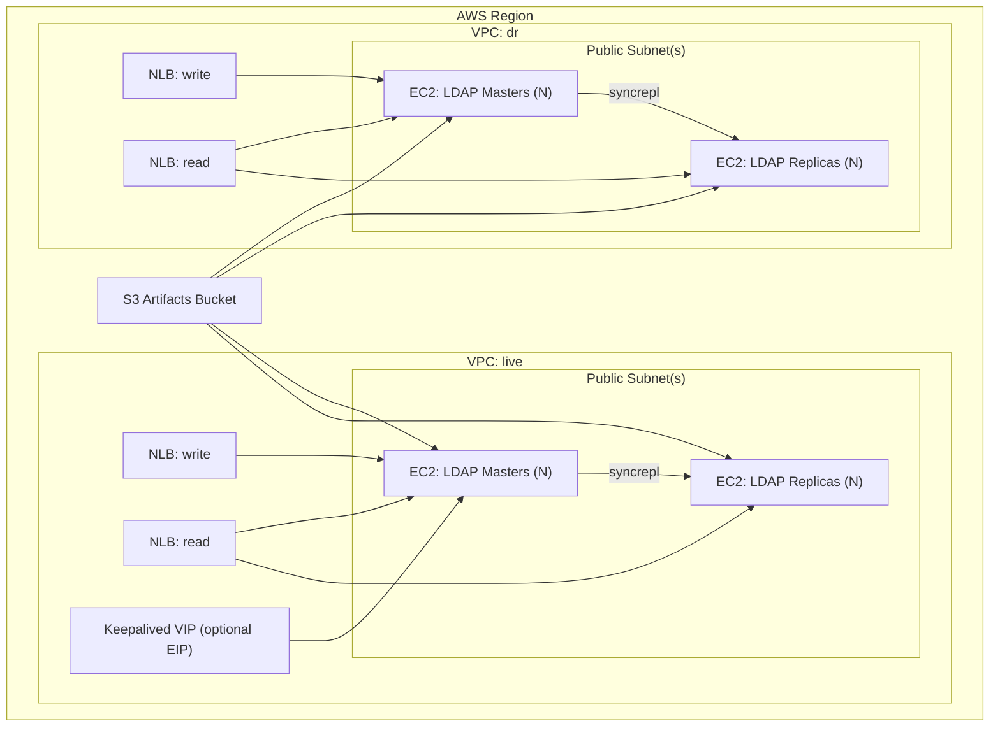

# OpenLDAP DC Simulation Runbook (Terraform + On-Prem)

This runbook explains how the AWS Terraform build boots each instance, and how to
run the same scripts and LDIFs on a real data center host over SSH.

## AWS OpenLDAP Architecture (Mermaid)



## 1) What Terraform does per instance

Terraform provisions:

- 2 VPCs (live, dr), public subnets, and security groups.
- N masters + replicas per VPC (see `masters_per_vpc`, `replicas_per_vpc`).
- Network Load Balancers for read and write.
- Optional keepalived EIP to simulate a single VIP failover.
- An S3 artifacts bucket containing your scripts and LDIFs.

At boot, each EC2 instance runs `terraform/openldap/templates/user-data.sh.tmpl`:

1. Downloads artifacts from S3 into `/opt/openldap/`.
2. Executes `/opt/openldap/bootstrap/bootstrap-ldap.sh`.

The bootstrap script is the single source of truth for the exact steps applied
to each instance. If you can run that script on-prem, the behavior will match
AWS.

## 2) Artifacts layout (same in AWS + on-prem)

The following local folders are uploaded to S3 (see `terraform/openldap/artifacts.tf`)
and synced to the host:

- `script/` -> `/opt/openldap/script/` (your Symas / tuning scripts)
- `openldap-mirrormode/ldif/` -> `/opt/openldap/ldif-src/` (replication LDIFs)
- `openldap-mirrormode/scripts/` -> `/opt/openldap/mirrormode-scripts/` (tests/utilities)
- `terraform/openldap/artifacts/bootstrap-ldap.sh` -> `/opt/openldap/bootstrap/`

Important: `bootstrap-ldap.sh` installs and configures OpenLDAP but **does not
auto-run** the scripts in `/opt/openldap/script/`. You can run those manually
after bootstrap (see section 5).

## 3) LDIF order and role behavior

`bootstrap-ldap.sh` generates and applies the replication LDIFs in this order:

All nodes:
1. `01-replicator.ldif` (adds the replication bind user)
2. `02-replicator-acl.ldif` (allows replicator read access)
3. `10-serverid.ldif` (sets the server ID)

Masters only:
4. `19-load-syncprov.ldif` (loads syncprov module)
5. `20-syncprov-master.ldif` (adds syncprov overlay)
6. `21-mirrormode-master.ldif` (MirrorMode + peer provider)

Replicas only:
4. `30-replica-consumer.ldif` (syncrepl consumer config)
5. `31-replica-readonly.ldif` (read-only overlay)

It also sets:

- `BASE_DN` and `ADMIN_DN` in `cn=config`
- A minimal base DIT: base DN, `ou=people`, `ou=groups`

## 4) AWS Terraform flow (simulation)

1) Configure variables (example `terraform.tfvars`):

```hcl
aws_region = "us-east-1"
project_name = "openldap-mm"
ssh_key_name = "your-keypair"
admin_password = "admin"
replication_password = "replpass"
create_artifacts_bucket = true
upload_local_artifacts = true
```

2) Initialize and apply:

```bash
cd terraform/openldap
terraform init -backend-config=backend.hcl
terraform apply
```

3) Watch bootstrap logs on an instance:

```bash
sudo tail -f /var/log/cloud-init-output.log
```

4) Useful outputs (IPs, load balancers, artifacts bucket):

```bash
terraform output instance_public_ips
terraform output instance_private_ips
terraform output write_lb_dns
terraform output read_lb_dns
terraform output artifacts_bucket_name
```

If you change scripts or LDIFs, re-run `terraform apply` to upload them, then
SSH to a node and re-run `/opt/openldap/bootstrap/bootstrap-ldap.sh`.

## 5) On-prem / SSH flow (real DC)

Goal: run the **same** bootstrap process that AWS uses.

### 5.1 Copy artifacts to each host

From your workstation, copy the artifacts to the host (example paths):

```bash
# On the target host (run once)
sudo mkdir -p /opt/openldap/{bootstrap,script,ldif-src,mirrormode-scripts}

# From your workstation (repeat for each host)
scp terraform/openldap/artifacts/bootstrap-ldap.sh root@HOST:/opt/openldap/bootstrap/
scp -r script/* root@HOST:/opt/openldap/script/
scp -r openldap-mirrormode/ldif/* root@HOST:/opt/openldap/ldif-src/
scp -r openldap-mirrormode/scripts/* root@HOST:/opt/openldap/mirrormode-scripts/

# On the host
sudo chmod +x /opt/openldap/bootstrap/bootstrap-ldap.sh
```

### 5.2 Create a per-node env file

Create `/opt/openldap/bootstrap/node.env` on each host with node-specific values:

Example (master):

```bash
ROLE=master
VPC_NAME=live
BASE_DN=dc=cae,dc=local
ADMIN_DN=cn=admin,dc=cae,dc=local
ADMIN_PW=admin
REPL_DN=cn=replicator,dc=cae,dc=local
REPL_PW=replpass
SERVER_ID=1
PRIVATE_IP=10.10.0.10
LDAP_PORT=389
WRITE_LB_DNS=ldap-write.example.local
ORG_NAME=CAE
MASTER_IPS="10.10.0.10 10.10.0.11"
KEEPALIVED_ENABLED=true
KEEPALIVED_ROLE=MASTER
KEEPALIVED_PEER_IP=10.10.0.11
KEEPALIVED_PRIORITY=200
KEEPALIVED_AUTH_PASS=openldap
KEEPALIVED_EIP_ALLOC_ID=
```

Example (replica):

```bash
ROLE=replica
VPC_NAME=live
BASE_DN=dc=cae,dc=local
ADMIN_DN=cn=admin,dc=cae,dc=local
ADMIN_PW=admin
REPL_DN=cn=replicator,dc=cae,dc=local
REPL_PW=replpass
SERVER_ID=101
PRIVATE_IP=10.10.0.30
LDAP_PORT=389
WRITE_LB_DNS=ldap-write.example.local
ORG_NAME=CAE
MASTER_IPS="10.10.0.10 10.10.0.11"
KEEPALIVED_ENABLED=false
```

### 5.3 Run bootstrap on each host

```bash
cd /opt/openldap/bootstrap
set -a
source ./node.env
set +a
sudo -E ./bootstrap-ldap.sh
```

This will:

- Install OpenLDAP (RHEL packages).
- Configure base DN and admin.
- Apply role-specific replication LDIFs.
- Optionally configure keepalived.

### 5.4 Run your custom scripts (optional)

Your Symas / tuning scripts are under `/opt/openldap/script/`. Run them when you
want to apply additional configuration beyond the bootstrap:

```bash
sudo bash /opt/openldap/script/install-symas-openldap-all-in-one.sh
# or
sudo bash /opt/openldap/script/install-automated.sh
```

Note: these scripts are independent of `bootstrap-ldap.sh`. If you want AWS and
on-prem to behave the same, keep the same script versions in `script/` and run
them in the same order on every host.

### 5.5 Run bootstrap on all hosts over SSH (optional)

If each host already has its own `/opt/openldap/bootstrap/node.env`, you can
trigger bootstrap across all nodes:

```bash
HOSTS="ldap1.example.local ldap2.example.local ldap3.example.local"
for h in $HOSTS; do
  ssh root@"$h" 'set -a; source /opt/openldap/bootstrap/node.env; set +a; sudo -E /opt/openldap/bootstrap/bootstrap-ldap.sh' &
done
wait
```

## 6) Mapping Terraform outputs to on-prem values

Terraform already computes per-node values. Use these as your on-prem template:

- `instance_private_ips` -> `PRIVATE_IP` and `MASTER_IPS`
- `write_lb_dns` -> `WRITE_LB_DNS` (or your on-prem write VIP)
- `keepalived_eip_public_ip` -> on-prem VIP
- `base_dn`, `admin_password`, `replication_password` -> the same values in `node.env`

If you want help generating a full on-prem inventory file, share your desired
node list and IPs and I can produce a ready-to-run set of `node.env` files.
